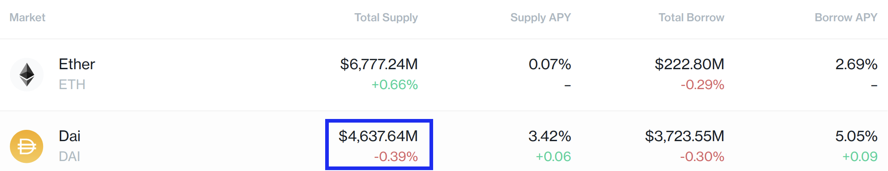
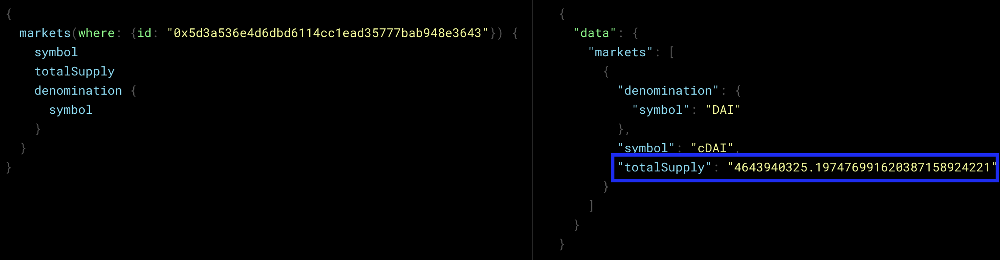
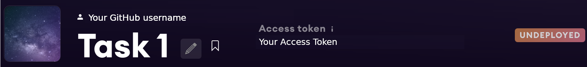
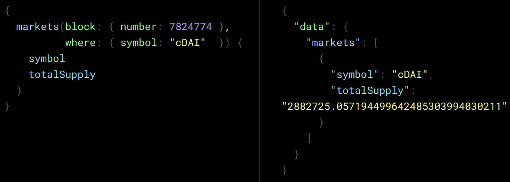

# Task 1: Introduction to subgraphs

This task will introduce you to subgraphs and the process to deploy them. 

This directory contains source code for a subgraph which we have deployed [here](https://thegraph.com/hosted-service/subgraph/token-terminal/compound-v2-ethereum). We will guide you through deploying this subgraph in your own account. This is the actual subgraph we use to index data from the [Compound](https://compound.finance/) protocol, which we then show in our Compound project [page](https://www.tokenterminal.com/terminal/projects/compound)!

## Background

[Compound](https://compound.finance/) is a non-custodial lending protocol built on [Ethereum](https://ethereum.org/). When you supply cryptoassets ([tokens](https://www.coinbase.com/learn/crypto-basics/what-is-a-token)) to Compound, you receive corresponding *cTokens*. You can think of these as crypto-native certificates of deposit for a particular market which entitle you to an increasing quantity of the underlying asset on a future date. For example, if you deposit [DAI](https://etherscan.io/token/0x6b175474e89094c44da98b954eedeac495271d0f), you will receive a certain amount the corresponding *[cToken](https://compound.finance/docs/ctokens)*, [cDAI](https://etherscan.io/token/0x5d3a536E4D6DbD6114cc1Ead35777bAB948E3643).

You can track real-time data related to these markets in the Compound markets [page](https://compound.finance/markets). The figure below shows data on the two biggest Compound markets (Ether and Dai as of Dec 8th 2021).



One of the coolest things about blockchains is that all data is open-source and can be tracked in real-time, so anyone can use tools like The Graph to obtain this same data. The subgraph you'll deploy does just that. 

For example, to obtain the highlighted data on total supply, you can navigate to the subgraph playground [page](https://thegraph.com/hosted-service/subgraph/token-terminal/compound-v2-ethereum) and use the query on the left side of the following image (see [here](https://thegraph.com/docs/developer/graphql-api) for docs on the [GraphQL](https://graphql.org/) query API syntax and features). The result of the query is shown on the right.



<!-- 
Contents of figure above in text format:
```gql
{
  markets(where: {id: "0x5d3a536e4d6dbd6114cc1ead35777bab948e3643"}) {
    symbol
    totalSupply
    denomination {
      symbol
      decimals
    }
  }
}
```
Query result:
```json
{
  "data": {
    "markets": [
      {
        "denomination": {
          "decimals": 18,
          "symbol": "DAI"
        },
        "symbol": "cDAI",
        "totalSupply": "4643947708.516982238573901163082707"
      }
    ]
  }
}
```
-->

Note that `id` -> `0x5d3a536e4d6dbd6114cc1ead35777bab948e3643` is the ethereum [address](https://ethereum.org/en/developers/docs/accounts/#contract-accounts) for the cDAI market. 

Our subgraph returns a total supply of ~4,643,947,708 DAI. [DAI](https://en.wikipedia.org/wiki/Dai_(cryptocurrency)) is a stablecoin whose value is very close to $1. Therefore, we can see how this value is very close to the total DAI supply in the markets screenshot (they don't match 1:1 because 1) the data in both sources wasn't queried at the same time and 2) 1 DAI is not exactly equal to $1).

## Deploying the subgraph

### Initialize the subgraph on The Graph's hosted service

Follow these steps:

1. Navigate to The Graph's [hosted service](https://thegraph.com/hosted-service/).
2. Sign in using your GitHub credentials.
3. Navigate to your [dashboard](https://thegraph.com/hosted-service/dashboard/).
4. Click the "Add Subgraph" button.
5. Fill in the required fields.
    - **Subgraph Name**: Task 1.
    - **Account**: leave as default (should be your name on GitHub).
    - **Subtitle**: Task 1.
6. Enable the "hide" button.
7. Click "Create subgraph".

After these steps, you should be taken to your new subgraphs's page (`https://thegraph.com/hosted-service/subgraph/YOUR-GITHUB-NAME/task-1`) which will show it as *undeployed*:



### Deploy

Now, assuming you already installed the Graph CLI as detailed in the main [README](../../tt-subgraphs-homework/README.md) file, we're ready to deploy the subgraph whose source code is this directory. At this stage, we simply want to take you through the mechanics of deploying a subgraph, and we will go into the details in [task-2](../task-2). 

Ensure your terminal's current directory is the `task-1` root directory, then start by installing the necessary dependencies:

```bash
$ npm ci
```

Generate AssemblyScript types from the subgraph's GraphQL schema (`schema.graphql` file) and the contract [ABIs](https://ethereum.stackexchange.com/questions/234/what-is-an-abi-and-why-is-it-needed-to-interact-with-contracts/1171) (included in the `abis` directory):

```bash
$ npm run codegen
```

Compile the subgraph:

```bash
$ npm run build
```

Change `YOUR-GITHUB-NAME` to your actual GitHub username in `package.json`.

Use your access token, which you can find in your subgraph page (see image above), to authenticate:

```bash
$ graph auth --product hosted-service <ACCESS_TOKEN>
```

Deploy:

```bash
$ npm run deploy
```

Your subgraph should now be deployed here: `https://thegraph.com/hosted-service/subgraph/<YOUR-GITHUB-NAME>/task-1`.

Let's try querying the total supply of the `cDAI` market:


<!-- 
Contents of figure above in text format:
```gql
{
  markets(block: { number: 7824774 },
          where: { symbol: "cDAI"  }) {
    symbol
    totalSupply
  }
}
```
Query result:
```json
{
  "data": {
    "markets": [
      {
        "symbol": "cDAI",
        "totalSupply": "2882725.057194499642485303994030211"
      }
    ]
  }
}
```
-->

In addition to filtering the search results for a specific market (`cDAI`), we also performed the search for a specific ethereum [block](https://ethereum.org/en/developers/docs/blocks/) ([7824774](https://etherscan.io/block/7824774)). If you try the same query in the production subgraph (deployed [here](https://thegraph.com/hosted-service/subgraph/token-terminal/compound-v2-ethereum)) you should get the same result.

This concludes task 1! 💪
