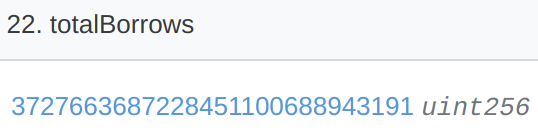
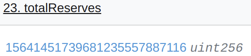
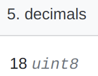
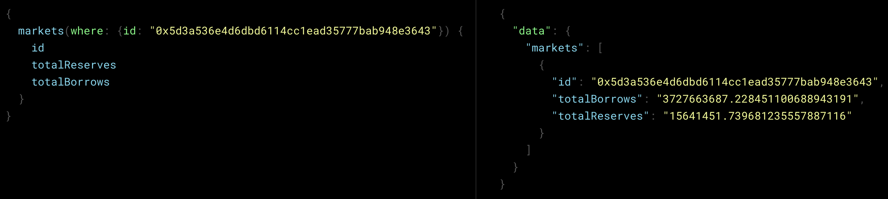

# Task 2: Add total reserves to a Compound subgraph

On this task, we will deploy the same subgraph as in task 1, but this time, before deploying, you will add one field that is missing in the Market entity.

## Background

Let's focus again on the [cDAI](https://etherscan.io/token/0x5d3a536E4D6DbD6114cc1Ead35777bAB948E3643) contract. If we navigate to the "[Read as Proxy](https://etherscan.io/address/0x5d3a536E4D6DbD6114cc1Ead35777bAB948E3643#readProxyContract)" page on the Contract tab of the cDAI contract page on Etherscan, we can query for the contract's public variables. Two of these variables are:

`totalBorrows`: Total amount of outstanding borrows of the underlying in this market



`totalReserves`: Total amount of reserves of the underlying held in this market



Note that the values of `totalBorrows` and `totalReserves`, respectively `3727663687228451100688943191` and `15641451739681235557887116`, are denominated in the underlying asset before correcting for [decimals](https://docs.openzeppelin.com/contracts/2.x/erc20#a-note-on-decimals). This means that to convert these values to the native units of the underlying, which is [Dai](https://etherscan.io/token/0x6b175474e89094c44da98b954eedeac495271d0f), we need to divide them by 10^decimals. Dai is represented with 18 decimals (which can be confirmed reading the Dai contract on [etherscan](https://etherscan.io/token/0x6b175474e89094c44da98b954eedeac495271d0f#readContract)):



Therefore:

- `totalBorrows` = 3727663687228451100688943191/10^18 = ~3727663687 DAI
- `totalReserves` = 15641451739681235557887116/10^18 = ~15641451 DAI

Querying for these variables in the Token Terminal Compound [subgraph](https://thegraph.com/hosted-service/subgraph/token-terminal/compound-v2-ethereum), we see:


<!-- 
Contents of figure above in text format:
```gql
{ 
  markets(where: {id: "0x5d3a536e4d6dbd6114cc1ead35777bab948e3643"}) {
    id
    totalReserves
    totalBorrows
  }
}
```
Query result:
```json
{
  "data": {
    "markets": [
      {
        "id": "0x5d3a536e4d6dbd6114cc1ead35777bab948e3643",
        "totalBorrows": "3727663687.228451100688943191",
        "totalReserves": "15641451.739681235557887116"
      }
    ]
  }
}
```
-->

Which as we can see matches the values seen on etherscan (figures above).

## The task

In this directory, we have the same source code that was used to deploy Token Terminal Compound [subgraph](https://thegraph.com/hosted-service/subgraph/token-terminal/compound-v2-ethereum), except that the code necessary to index `totalReserves` was removed. Your goals for this task are:

1. Change the subgraph code to enable indexing the `totalReserves` variable as a field in the `Market` entity. (Tip: looking at how `totalBorrows` was implemented will help you)
2. After 1, deploy the resulting subgraph code in `https://thegraph.com/hosted-service/subgraph/<YOUR-GITHUB-NAME>/task-2`, following the same series of steps you did on task 1. Note this will be a separate deployment to task 1's subgraph.

A tip on syncing speed and using etherscan as a benchmark: You will notice that the subgraph you will deploy takes a long time to sync, so the results of the queries to your subgraph will only match etherscan when your subgraph finishes syncing. Therefore, to benchmark your subgraph before it finishes syncing (to ensure your implementation works) you can use the Token Terminal Compound [subgraph](https://thegraph.com/hosted-service/subgraph/token-terminal/compound-v2-ethereum) and query it for a block for which your subgraph has already sync'd (recall that we used filter syntax on [task 1](../task-1/README.md) to query specific blocks). 
