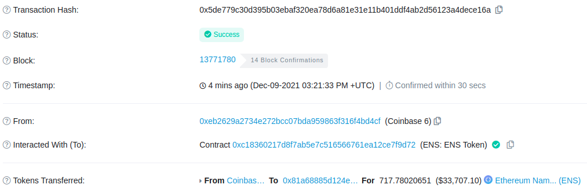

# Task 3: Track ENS token transfers

The goal for this task is to deploy a subgraph that indexes transfer events for the [ENS](https://etherscan.io/token/0xc18360217d8f7ab5e7c516566761ea12ce7f9d72) token, the governance token of the [Ethereum Name Service](https://ens.domains/) (ENS) protocol. 

You can think of ENS as [DNS](https://en.wikipedia.org/wiki/Domain_Name_System)'s Ethereum-based Web3 counterpart:

> ENS’s job is to map human-readable names like ‘alice.eth’ to machine-readable identifiers such as Ethereum addresses, other cryptocurrency addresses, content hashes, and metadata. _(read [here](https://docs.ens.domains/) for more about ENS)_

## The task

Most of the subgraph boilerplate is ready: 

- `schema.graphql`: you won't need to modify this, but take the time to get familiar with the `TransferEvent` entity fields.
- `package.json`: you just need to replace your GitHub username into the appropriate place.
- `subgraph.yaml`: also ready to go - note you're only going to start indexing transfers from block [13770000](https://etherscan.io/block/13770000). This will ensure the subgraph syncs quickly and you'll able to benchmark against the most recent transfers on the ENS token Etherscan [page](https://etherscan.io/token/0xc18360217d8f7ab5e7c516566761ea12ce7f9d72#transfers).

Your goal for this task is to modify the `src/mappings.ts` file with the logic to index the fields of `TransferEvent`. Here are some tips:
- The comments in the mappings file are a guide of what you need to implement.
- Check the access to smart contract state section of the subgraph docs ([here](https://thegraph.com/docs/developer/assemblyscript-api#access-to-smart-contract-state)).

Once you've done the above, deploy the subgraph just like you did in previous tasks (i.e. should end up deployed in `https://thegraph.com/hosted-service/subgraph/<YOUR-GITHUB-NAME>/task-3`).

To benchmark your implementation, you can use the ENS token Etherscan [page](https://etherscan.io/token/0xc18360217d8f7ab5e7c516566761ea12ce7f9d72#transfers). For example, here's a screenshot from a recent [transfer](https://etherscan.io/tx/0x5de779c30d395b03ebaf320ea78d6a81e31e11b401ddf4ab2d56123a4dece16a) picked randomly:



Using the subgraph you deployed, you should be able to construct a GraphQL query that fetches data from this transaction. The result of such a query should look like:

```json
{
  "data": {
    "transferEvents": [
      {
        "block": "13771780",
        "fromAddress": "0xeb2629a2734e272bcc07bda959863f316f4bd4cf", 
        "fromBalance": "5653497465561792575789",
        "id": "0x5de779c30d395b03ebaf320ea78d6a81e31e11b401ddf4ab2d56123a4dece16a",
        "timestamp": 1639063293,
        "toAddress": "0x81a68885d124e8f1b50a544fa80df39eb8014060",
        "toBalance": "717780206510000000001",
        "transferAmount": "717780206510000000000"
      }
    ]
  }
}
```

Note that to keep the subgraph code simpler, we did not correct `fromBalance`, `toBalance` and `transferAmount` for its native token decimals (recall we discussed this issue in task 2). This is the reason why we get, for example, a `transferAmount` equal to `717780206510000000000` and not `717.78020651` (Etherscan shows these values after correcting for the underlying token's decimals). If you want to go the extra mile, you could extend your subgraph code to do this natively 😉.
