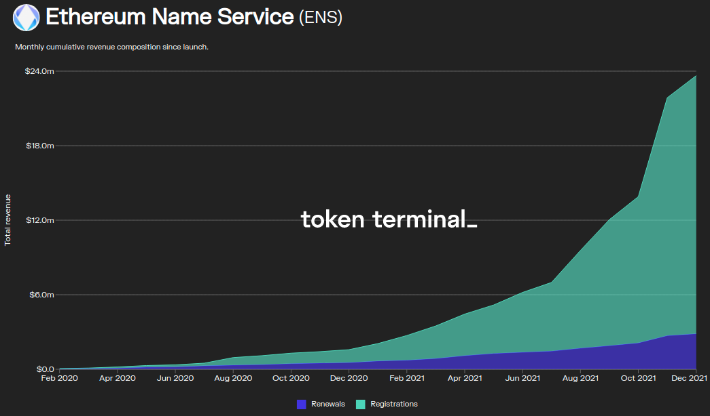

# Task 4: Create a subgraph that tracks fees generated by the ENS protocol.

## Background

The ENS protocol charges fees for:

- [Registering](https://docs.ens.domains/frequently-asked-questions#what-does-it-cost-to-register-a-.eth-domain) .eth domains.
- [Renewing](https://docs.ens.domains/permanent-registrar-faq#how-much-will-the-yearly-renewals-cost) .eth domains.

When users register or renewal domains, they interact with a controller contract called `ETHRegistrarController` ([docs](https://docs.ens.domains/contract-api-reference/.eth-permanent-registrar/controller), [source](https://github.com/ensdomains/ethregistrar/blob/master/contracts/ETHRegistrarController.sol), [etherscan](https://etherscan.io/address/0x283Af0B28c62C092C9727F1Ee09c02CA627EB7F5#code)) (note: these contracts are written in [Solidity](https://docs.soliditylang.org/en/v0.8.10/index.html)). 

For this task, the [events](https://ethereum.org/en/developers/tutorials/logging-events-smart-contracts/) that are relevant are: 

- [`NameRegistered`](https://github.com/ensdomains/ethregistrar/blob/916dff21bf427771e67af11611b811f870aa7200/contracts/ETHRegistrarController.sol#L39).
- [`NameRenewed`](https://github.com/ensdomains/ethregistrar/blob/916dff21bf427771e67af11611b811f870aa7200/contracts/ETHRegistrarController.sol#L40).

You will be able to track renewal, registration costs (i.e. fees) by indexing the `cost` parameter of these events.

## The task

The goal for this task if for you to develop a subgraph that tracks, cumulatively, the fees generated by the [Ethereum Name Service](https://ens.domains/) (ENS) protocol. Ultimately, the subgraph you will develop could be used to power a chart like the following from the ENS project [page](https://www.tokenterminal.com/terminal/projects/ethereum-name-service) on Token Terminal!



A key difference from the other tasks is that this time you will generate the subgraph boilerplate code yourself, using the [`graph init`](https://thegraph.com/docs/developer/quick-start#2-initialize-your-subgraph-1) command. In particular, this subgraph will be deployed on the hosted service to track events from the [`ETHRegistrarController`](https://etherscan.io/address/0x283Af0B28c62C092C9727F1Ee09c02CA627EB7F5#code) contract on the Ethereum mainnet. 

After running the `graph init` command, your directory structure should look like this:
```.
├── abis
│   └── ETHRegistrarController.json
├── generated
│   ├── ETHRegistrarController
│   └── schema.ts
├── node_modules
│   └── (...)
├── package.json
├── package-lock.json
├── schema.graphql
├── src
│   └── mapping.ts
├── subgraph.yaml
└── tsconfig.json
```

Tips: 
- You will need to define your own schema. To keep things simple, a possibility is to have a `Global` entity with `registrationFees` and `renewalFees` as fields (you'll also need to provide an arbitrary `id` to this single `Global` entity (e.g. `1`)).
- The `ETHRegistrarController` was [deployed](https://etherscan.io/tx/0xd3ccf9466b92e907b17b9c6712ef9d91c1794e7b0f319be5c65bcda1d192c0b8) on block `9380471`, so you only need to start indexing events from this block.
- `mappings.ts` will be autogenerated with several event handler functions, you only need handlers for the relevant events we mentioned above. You should also remove the unnecessary `eventHandlers` from `subgraph.yaml`.

## Benchmarking

The data you obtain from the `cost` parameter is denominated in ETH, whereas the data in the ENS project [page](https://www.tokenterminal.com/terminal/projects/ethereum-name-service) on Token Terminal is denominated in USD, so it can't be directly used for benchmarking. 

To make it easy for you to benchmark you implementation, here are benchmark fee values at block `10000000` (corrected for decimals):

- Total cumulative registration fees (in ETH): 597.183159242075665011.
- Total cumulative renewal fees (in ETH): 669.238916721038983157.
